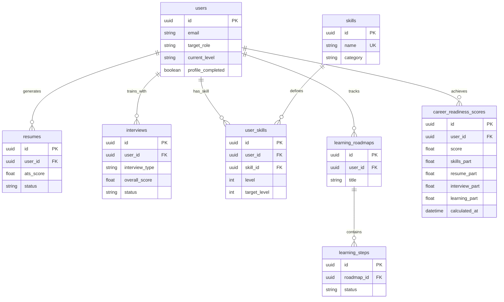

# Phase 2 Database Extension

The database for Phase 2 extends the Phase 1 schema, adding new tables for Skills, Learning Roadmaps, and Career Readiness tracking, while introducing relationships to link these models directly to the `User`.

## Schema Overview



## How to Initialize

1. **Apply Migrations**
   ```bash
   cd backend
   alembic upgrade head
   ```

2. **Seed Demo Data**
   The seed script generates a demo user with a realistic dataset (skills, parsed resume score, multiple completed mock interviews, an active learning roadmap, and a calculated readiness score). The script is idempotent; executing it multiple times safely updates or skips existing records.
   
   ```bash
   cd backend
   python -m app.scripts.seed_demo
   ```
   **Credentials:** `demo@careerpilot.ai` / `demo123`

## SQL Verification Queries

To manually confirm the database state using `psql`, `pgAdmin`, or another client:

### 1. View all tables
```sql
SELECT tablename 
FROM pg_catalog.pg_tables 
WHERE schemaname != 'pg_catalog' AND schemaname != 'information_schema';
```

### 2. Verify Demo User Skills
Retrieve the demo user's skills and compare current proficiency against targets:
```sql
SELECT u.name, s.name as skill, us.level, us.target_level
FROM users u
JOIN user_skills us ON u.id = us.user_id
JOIN skills s ON us.skill_id = s.id
WHERE u.email = 'demo@careerpilot.ai';
```

### 3. Review Career Readiness Score Breakdown
Examine the formula components for the most recent readiness score:
```sql
SELECT score, skills_part, resume_part, interview_part, learning_part, calculated_at
FROM career_readiness_scores
WHERE user_id = (SELECT id FROM users WHERE email = 'demo@careerpilot.ai')
ORDER BY calculated_at DESC
LIMIT 1;
```

### 4. Verify Privacy/Isolation (Counts)
Confirm records are bound strongly to the user to prevent data leaks across accounts.
```sql
SELECT 
    (SELECT COUNT(*) FROM user_skills WHERE user_id = u.id) as user_skill_count,
    (SELECT COUNT(*) FROM resumes WHERE user_id = u.id) as resume_count,
    (SELECT COUNT(*) FROM interviews WHERE user_id = u.id) as interview_count,
    (SELECT COUNT(*) FROM learning_roadmaps WHERE user_id = u.id) as roadmap_count
FROM users u
WHERE u.email = 'demo@careerpilot.ai';
```
